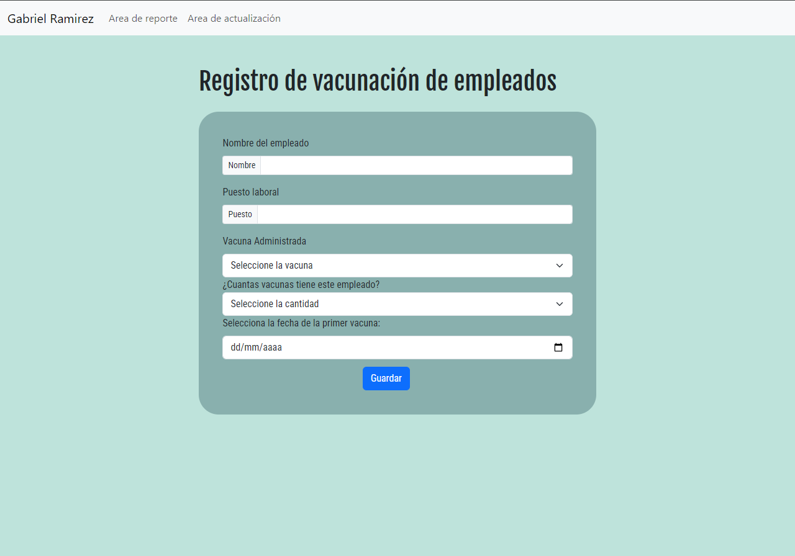

# Prueba Tecnica

Realizado por Juan Gabriel Ramirez Gramajo

## Manual Tecnico

### Entorno de desarrollo

IDE: Intellij IDEA v2023.3.4

JDK v20.0.2

DB: SQL Server 2022

OS: Windows 10

Framework: SpringBoot v2.6.4

Spring Security: 5.2.8

Javax.servlet: 4.0.0

### Configuración del proyecto

#### Inicializacion del proyecto

Para poder correr el proyecto de manera funcional recomiendo seguir los siguientes pasos:

- Descargar el repositorio desde github o clonarlo con git.

- Abrir el proyecto en Intellij IDEA o Spring tool suit

Antes de continuar se debera configurar el proyecto para la respectiva db con sql server, para esto existe un archivo de configuración en este proyecto en la ruta src/main/resources/application.properties el cual tendra la siguiente configuracion:

Para empezar el puerto que le coloque fue el 1433 que es el mas comun para el desarrollo pero dependiendo la configuración que se tenga en SQL Server Configuration Manager se puede cambiar al que mas se acomode.

#### **Importante**:

- Considero una mejor opcion utilizar intellij idea puesto que windows da ciertos problemas con el firewall y el puerto que se haya seleccionado y este IDE tiene una configuración rapida para esto al abrir el proyecto

Despues el nombre de la base de datos a la que se quiere conectar el proyecto que como se ve en la imagen mi db se llamada crud_db y las credenciales de acceso al entorno propio de sql server que puede cambiar dependiendo de la db. Y eso es todo en cuando a la configuracion de spring para la db pero es importante crear una tabla en esa db llamada "Empleado" con el siguiente comando:

""""""""""""""""""""""""""""""""""""""""""""""""""""""""

USE nombreDeLaDB;

CREATE TABLE Empleado(
Id INT PRIMARY KEY IDENTITY(1,1),
name VARCHAR(200),
Job VARCHAR(200),
vaccine VARCHAR(100),
novaccines INT,
date DATE,
date2 DATE,
State VARCHAR(100)
);

""""""""""""""""""""""""""""""""""""""""""""""""""""""""

Una vez hecho esto ya deberia estar conectado sql server al proyecto por lo que lo unico que queria seria abrir el ide que se quiera ya sea intellij idea. Si se usa intellij hay que configurar el run del ide para que sea el de spring. Esto se puede hacer dando click sobre la opcion run en la barra e herramientas buscar la opcion llamada "Edit configurations..." y en la barra llamada run buscar y elegir la opcion spring-boot:run. Y con esto lo unico que quedaria por hacer es:

- Iniciar el proyecto
- Ir hacia un navegador e iniciar el localhost en el puerto 8080 de esta manera: localhost:8080

## Manual de usuario

El uso del proyecto es algo sencillo dado que se tiene 4 paginas donde se encuentran las funcionalidades del crud.

#### Login

Se creo un pequeño sistema de accesos para este proyecto con Spring-Security, para ello se creo la siguiente plantilla de html:

En ella se tiene un form normal con usuario y contraseña, para este caso hay un usuario ya quemado en el proyecto cuyas credenciales son:

Username: admin

Password: 123

Habiendo ingresado estas credenciales se redigira al usuario a la pestaña de registro de empleados la cual se explica a continuacion:

#### Registro

En este apartado se podra ingresar a la base de datos los datos de los empleados, pudiendo agregarles que tipo de vacuna se les aplico y cuantas dosis tienen puestas, esto con la condicion que no se utilicen registros iguales dado que la api no los aceptara, esto teniendo como identificador el nombre del empleado.

#### Actualización

En este apartado se podra actualizar los datos del registro de un empleado ingresando primeramente el id del empleado que se quiera actualizar o modificar, si no se ingresa un id valido o el usuario no existe no dejara modificar nada.

#### Reporte

La funcionalidad de este apartado es la de proporcionar informacion acerca de los registros que se tienen en la base de datos incluyendo el id del registro, el nombre del empleado, el puesto, la vacuna que se aplico, el estado de vacunación y la fecha de la proxima vacuna si es que es requerida. Ademas tambien encontramos en este apartado la opcion de eliminar el registro, esto mediante un boton que aparece al lado derecho de cada fila.

Cada una de estas pestañas tiene la opcion de salir y cerrar la sesion actual y cuando el usuario haya salido este no podra ingresar a las pestañas de gestion a menos que ingrese de nuevo.
